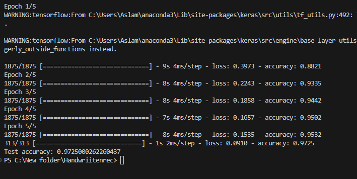
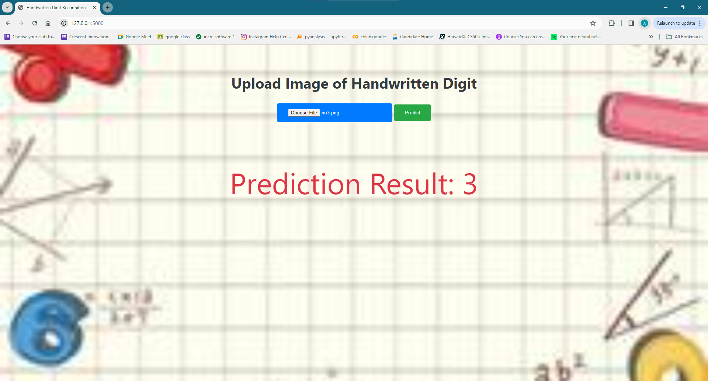

# Handwritten-Digit-Prediction

## Overview
This project aims to predict handwritten digits using a simple Deep Learning model.
The goal of this project is to demonstrate how to build a web-based interface to allow users to upload images of handwritten digits, which are then processed by a trained machine learning model to predict the digit.

## Data Preprocessing
- The dataset (MNIST) was used for training the model.
- Images were normalized and reshaped before training.

## Simple Deployment
 - Built with Flask, making it easy to deploy and run locally.

## Web Interface
- Allows users to upload images of handwritten digits via a web browser.

## Prediction
- Uses a trained deep learning model to predict the digit from the uploaded image.

**(Note: since the model is not 100% accurate , the predications made by the model may not be right all the time)**
 

