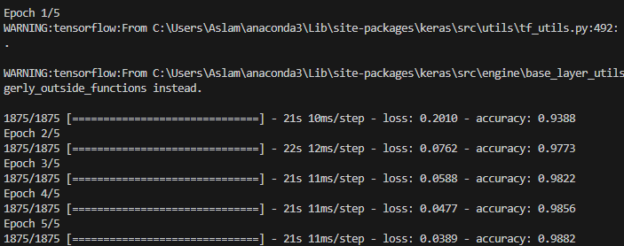
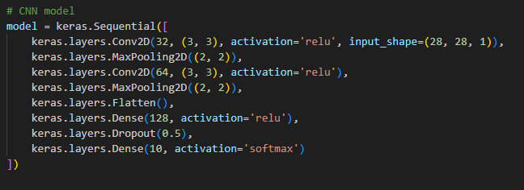
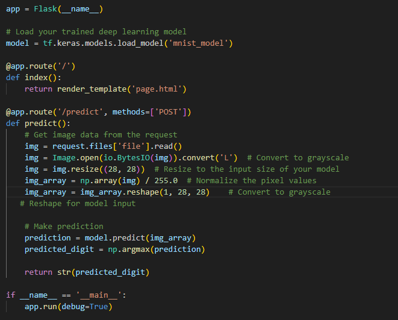
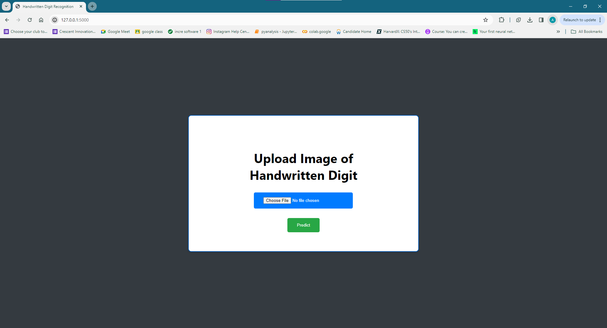
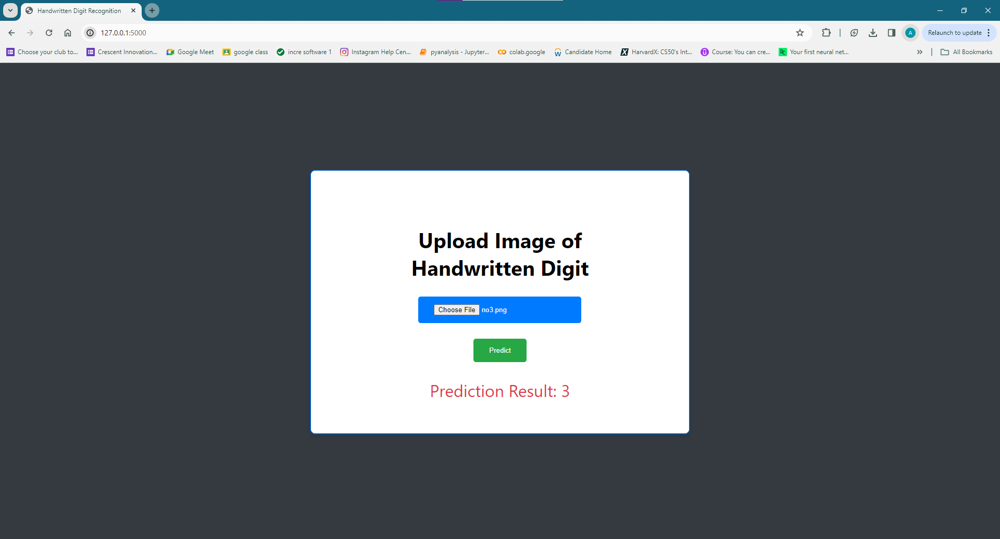

# Handwritten-Digit-Prediction with CNN

## Overview
This project is designed to predict handwritten digits using a Convolutional Neural Network (CNN). 
The goal is to create a web-based interface that allows users to upload images of handwritten digits. The uploaded images are then processed by a trained CNN model to predict the digit represented by the image.

## Data Preprocessing
- The dataset (MNIST) was used for training the model.
- Images were normalized and reshaped before training.

## Model Architecture
- the CNN model architecture consists of convolutional and pooling layers followed by fully connected layers:

## Training Process
  

## Simple Deployment
 - Built with Flask, making it easy to deploy and run locally.

## Web Interface
- Allows users to upload images of handwritten digits via a web browser.

## Prediction
- Uses a trained deep learning model to predict the digit from the uploaded image.

**(Note: since the model is not 100% accurate , the predications made by the model may not be right all the time)**
 

